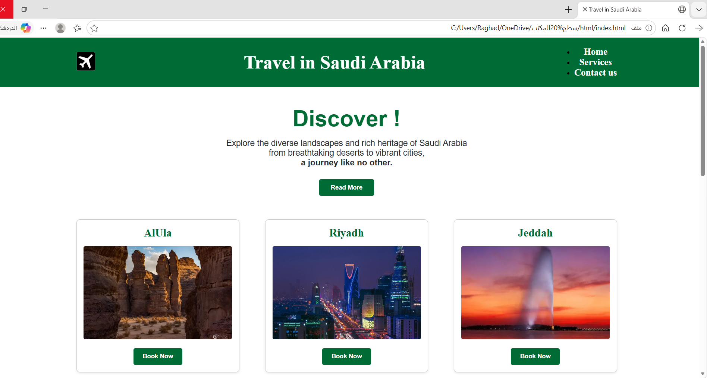
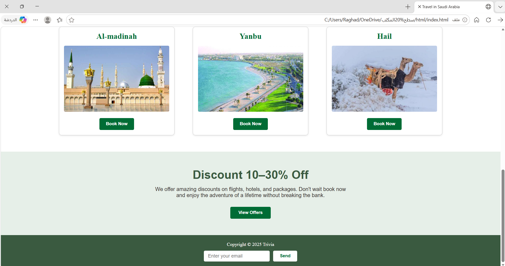
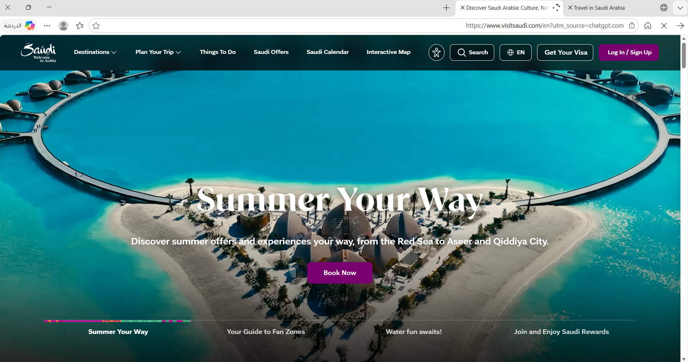
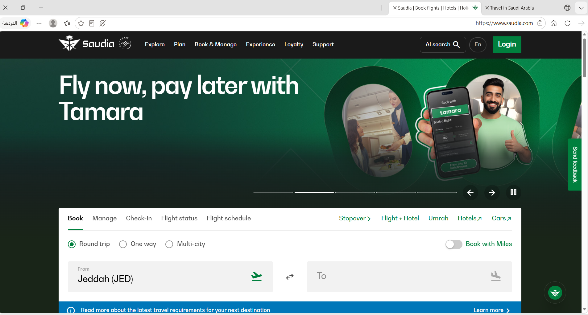

# Travel-in-Saudi-Arabia
Website interfaces for travel in Saudi Arabia using HTML-CSS

When you click the "read more" button, a new page appears on the official tourist website for readers containing more details about the cities.

Clicking the "Book Now" button will take you directly to the Saudi Airlines website to book your flight.

